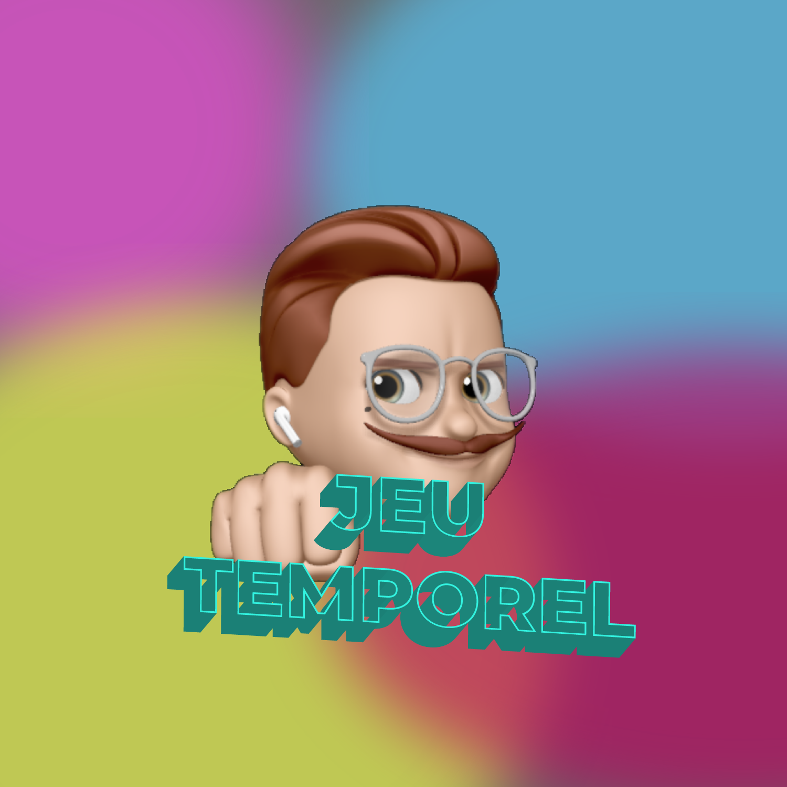
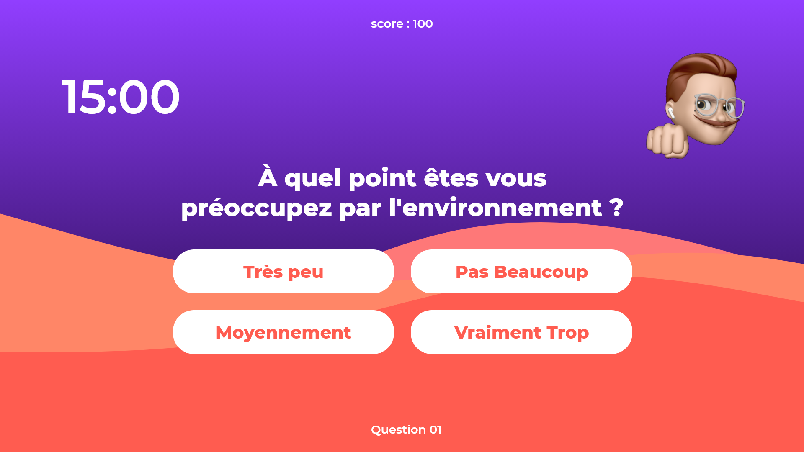
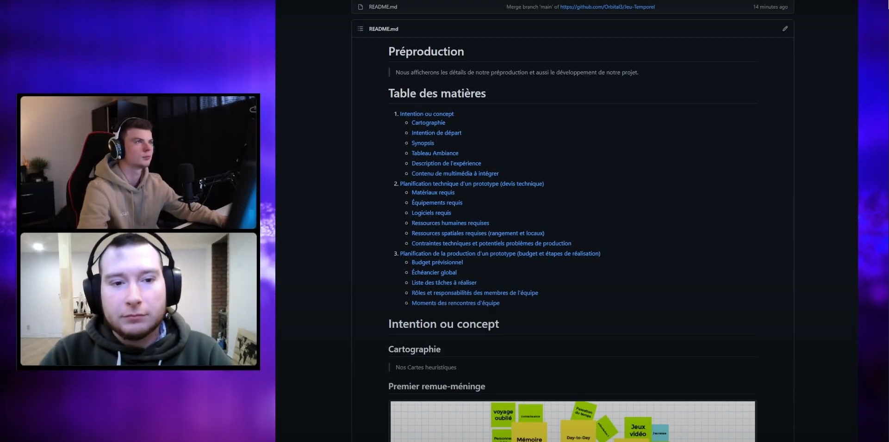
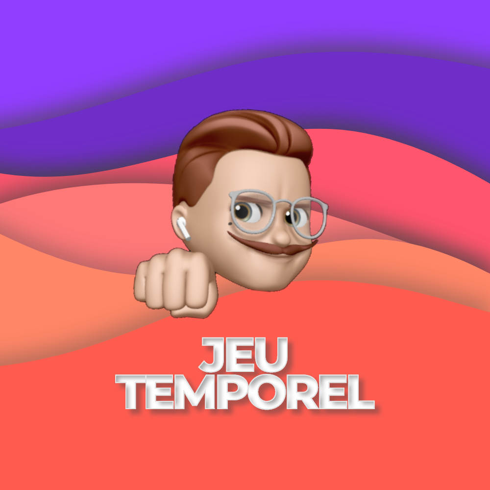
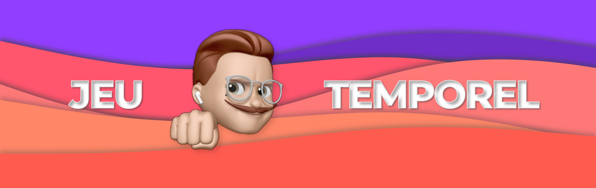
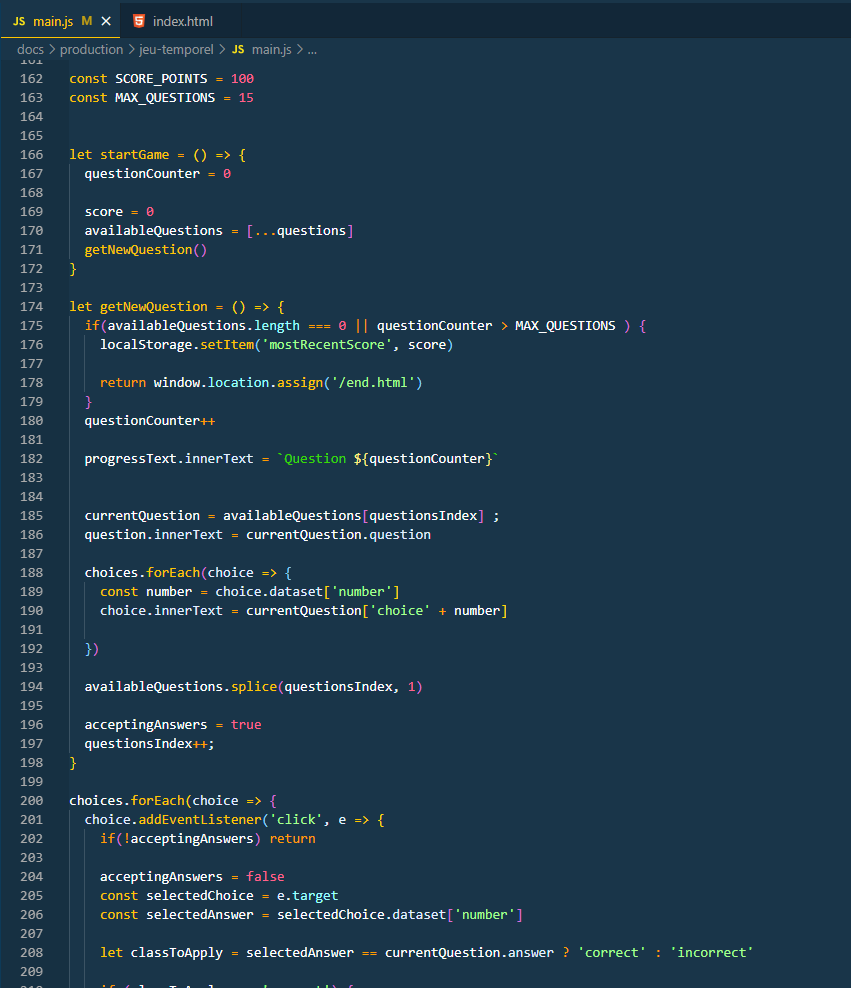
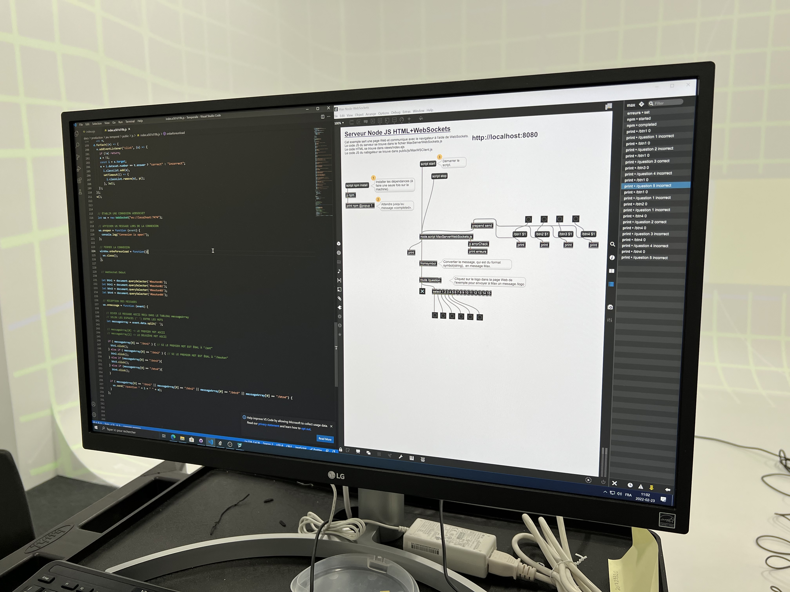
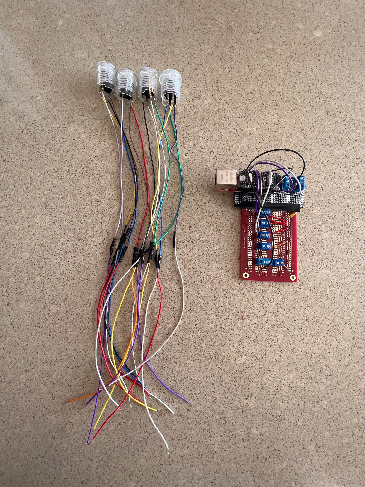
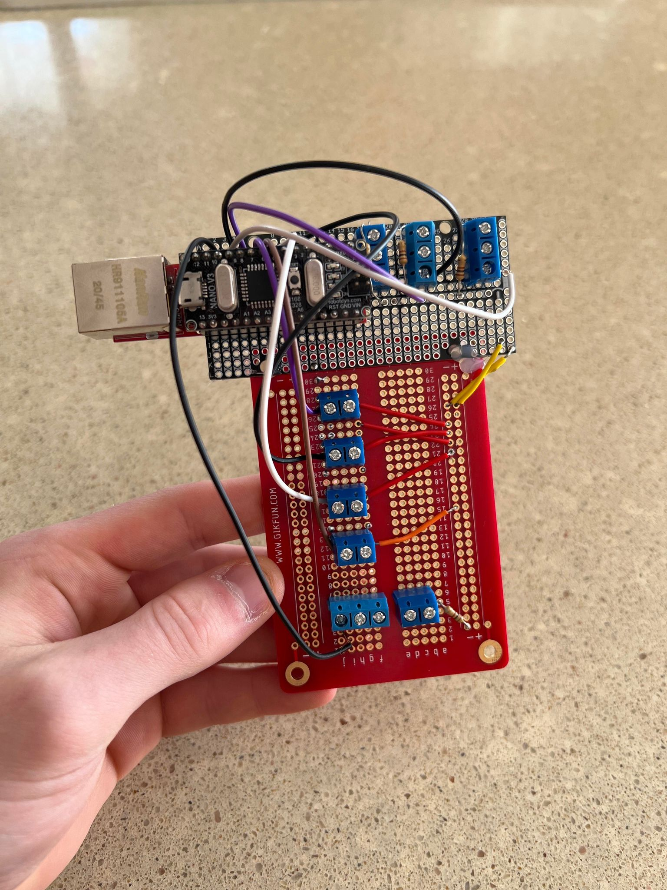
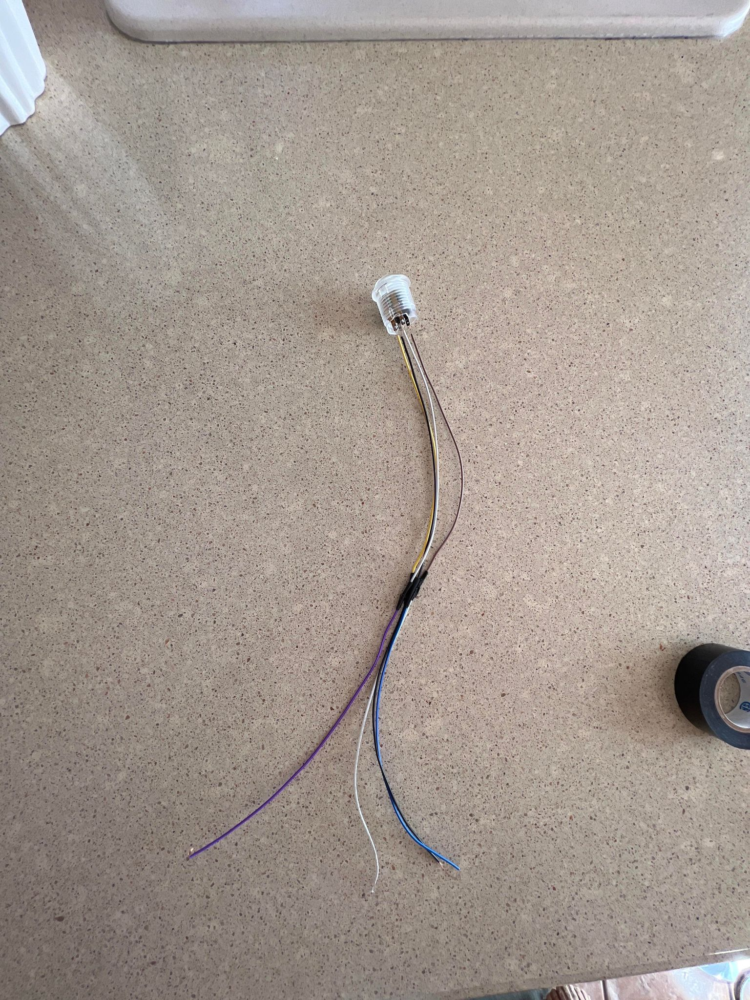

# Journal de création | *JEU TEMPOREL*
> ## Bienvenue au journal collectif de l'équipe Orbital3! C'est ici que nous allons faire le suivi de nos avancées dans le projet _**JEU TEMPOREL**_.
 

## Semaine 1

Nous avons commencé la semaine en retravaillant la préproduction, surtout les éléments qui étaient superflus ou pas totalement compréhensible. Nous avons aussi commencé les journaux respectifs de chacun des membres de l'équipe ainsi que le document que vous lisez en ce moment. 

 

**Philippe** a travaillé sur Unity pour corriger un bogue assez frustrant qui nous bloquait pour la continuité de l'expérience, ce problème faisait en sorte que nos questions n'était pas en ordre et qu'ils se répètaient, mais grâce à l'aide de Guillaume, ce problème a été réglé. Il a aussi fait la rédaction des questions pour en présenter pendant les prochaines rencontres. Il a commencé la rédaction du script de l'animateur, mais ceci va aller pour la semaine prochaine.

 

**Raphaël** a aussi travaillé un peu sur Unity pour corriger, mais très peu. Il a corrigé énormément la préproduction, surtout la partie schéma de plantation et de branchement. Il a fait les dessins ainsi que la description de l'équipements qui sera utilisé pour l'expérience. Il a aussi créer une bannière ainsi qu'un logo pour le projet. 

 

### **Voici le résultat final**
<kbd></kbd>
<kbd></kbd>

## Semaine 2

Nous avons commencé la semaine filmant notre vidéo de présentation du projet et de nos intentions. Nous avons aussi pris la décision au courant de la fin de semaine, je changer notre technologie utilisé, passant de Unity(programmation en C#) vers un projet utilisant HTML/CSS/Javascript. Par la suite, nous avons eu une rencontre avec nos professeurs pour faire une évaluation formative sur notre vidéo et avec les commentaires, nous avons fait une révision supplémentaire sur notre préproduction et avons refait notre vidéo de présentation.

 

**Philippe** a participé à la présentation vidéo des intentions du projet. Il a aussi commencé le projet web en créant un dossier en vite.js et a établi les bases du HTML et CSS. Philippe a aussi aidé lors d'une rencontre à corriger la préproduction.

 

**Raphaël** a participé à la présentation vidéo des intentions du projet. Il a aussi commencé le design d'un interface d'utilisateur pour le questionnaire et le site web en tant que tel. Il a été responsable de la création d'un dessin technique pour le podium et finalement, il a fait la réalisation d'un fichier Excel pour tout ce qui est l'inventaire digital et matériel de l'expérience.

### **Avancement de la semaine**
<kbd></kbd>
<kbd></kbd>

## Semaine 3
Nous avons commencé la semaine en faisant une nouvelle vidéo d'intentions avec les correctifs que les professeurs nous ont transmis. Nous avons aussi travailler sur le projet en faisant la base de notre questionnaire en HTML/CSS et aussi introduire le design que **Raphaël** a créé. Nous avons aussi commencé l'installation de l'expérience en studio. 

 

**Philippe** a participé à la nouvelle présentation vidéo des intentions du projet. Il a aussi fait la base du code HTML pour le questionnaire, ainsi que le CSS pour le design du questionnaire. Il a aussi paufiné la préproduction. Le coeur du projet a été entamé avec la programmation Javascript et va se continuer lors des prochaines semaines.

 

**Raphaël** a participé à la nouvelle présentation vidéo des intentions du projet. Il était chargé aussi de refaire le logo et la bannière, car elle n'était pas au goût de notre équipe. Il a aussi commencé l'installation de l'espace intéractive en studio. Il a aidé **Philippe** avec le code HTML/CSS de temps à autres.

### **Avancement de la semaine**
<kbd></kbd>
<kbd></kbd>
<kbd></kbd>
<kbd></kbd>
<kbd></kbd>

## Semaine 4
Pour la semaine 4, nous avons fait plusieurs tests sonore de terrain, afin de trouver l'emplacement idéal pour nos haut-parleurs et avons, du même fait, fait quelques réglages sur les projecteurs et le logiciel MapMapper. De plus, nous avons réglé plusieurs problèmes avec notre code Javascript pour ce qui était du changement de questions.

 

**Philippe** a participé à la 2e rencontre du comité de Communication et en groupe, ils ont trouvé un titre de projet et le résumé. Il a aussi trouvé des solutions au Javascript pour le questionnaire, avec l'aide d'un professeur. Il a été présent lors des test sonores et aidé au montage peu à peu de la scène dans le cyclo.

 

**Raphaël** c'est occupé principalement de tout ce qui faisait partie de l'installation, donc des haut-parleurs, des projecteurs, du *Mapping* sur le cyclo et de la gestion des câbles. Il a aussi, avec Philippe, commencé le prototypage de MAX et websocket pour l'envoie de vidéo.

## Semaine 5
Pour la semaine 5, nous avons avancé les installations dans le grand studio. Les hauts-parleurs et le podium sont installé à leurs place et le câblage a été effectué pour la pluspart. Il y a aussi eu un avancement dans la programmation du questionnaire avec Max, nous pouvons maintenant communiqué de Max vers le web et recevoir un retour pour ce qui est du numéro de question et si c'est une bonne/mauvaise réponse.

 

**Philippe** a construit le podium lors de la fin de semaine et l'a apporté au collège. Il a aussi fait quelques changements au CSS afin d'incorporer dans la nouvelle écran du podium. Il a aussi aidé avec le câblage.

 

**Raphäel** a beaucoup travaillé sur les installations techniques dans le grand studio (câblage, connexion, audio, etc.). Il s'est aussi beaucoup occupé de la connexion Max.

**Avancement de la semaine**
<kbd></kbd>
<kbd></kbd>
<kbd></kbd>
<kbd></kbd>

## Semaine 6
Pour la semaine 6, nous avons ralenti nos progrès pour la semaine de relâche. Tout les câblages dans le grand studio sont terminés, il reste juste à transféré le PC dans la salle des matrices. Nous avons aussi avancé le podium et l'arduino pour les boutons. Finalement, la connexion Max et Websocket a grandement été avancé.

**Philippe** a rajouté des rideaux sur le podium afin d'avoir un produit final plus propre et qui se font bien dans le noir. Il a aussi fait des modifications au HTML du menu principale afin de retirer l'option de quitter la projection - ceci n'avait pas trop de sens.

**Raphäel** s'est occupé de la soudure et programmation du Arduino nano. Il a connecté une entrée Ethernet et s'est arrangé pour avoir des boutons qui sont détachables. Il a aussi commencé les vidéos des questions 3 à 15 pour l'animateur.

**Avancement de la semaine**
<kbd></kbd>
<kbd></kbd>
<kbd></kbd>

## Semaine 7
La semaine 7 a été très productive et nous a permis d'avancée grandement dans nos projets. Nous avons réussi à connecter les boutons physiques vers arduino et ceux-ci communique avec Max en Websocket. Donc nous pouvons presser nos 4 boutons afin de choisir les réponses. De plus, nous avons fait en sorte d'avoir 2 choix de vidéos et que les vidéos démarre dès que le boutons est appuyer. Il y a aussi un délais de changement de question, seulement lorsqu'une vidéo fini. Finalement, beaucoups d'éléments additionnels ont été rajouté, par exemple : un fond de vague qui fait un rappel au jeu, une bande sonore de 10min avec changement à travers le temps et ainsi que 2 vidéos pour les 2 possibilités de fin.

**Philippe** a aidé avec la création de la bande sonore et des vidéos de fin. Il a aussi été présent pour les modifications sur Max et Arduino.

**Raphaël** a fait la programmation nécessaire pour Max et Arduino. Il a aussi fait les nombreuses vidéos d'animateurs et fait le changement du fond de vague derrière l'animateur. Finalement il a fait les modifications sur les boutons et la plaquette d'arduino afin d'assurer que le tout fonctionnait.

## Semaine 8 et 9

Les deux semaines ont été consacré à la finission de l'installation, au déplacement de l'équipement vers la salle des matrices et aux corrections de bug qui se produisait avant le vernissage.

Nous avons eu quelques problèmes avec le son qui se grichait avec du ''white noise'' ainsi qu'une désynchronisation dans la vidéo d'intro avec l'animateur et le son qui avait quelques milli-secondes de différence. 

On a ignoré le problème et tout simplement fait des redémarrages du son et de la vidéo, occasionnellement.

Lors de la présentation, durant le vernissage, tout c'est passé comme prévue, sans problème, sauf à la toute dernière minute ou deux musiques ont été l'un par dessus l'autre, créant une cacophonie. 

