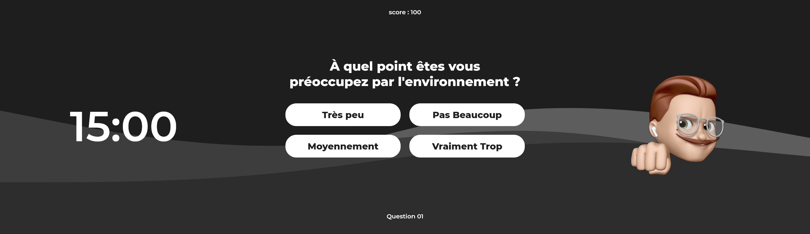
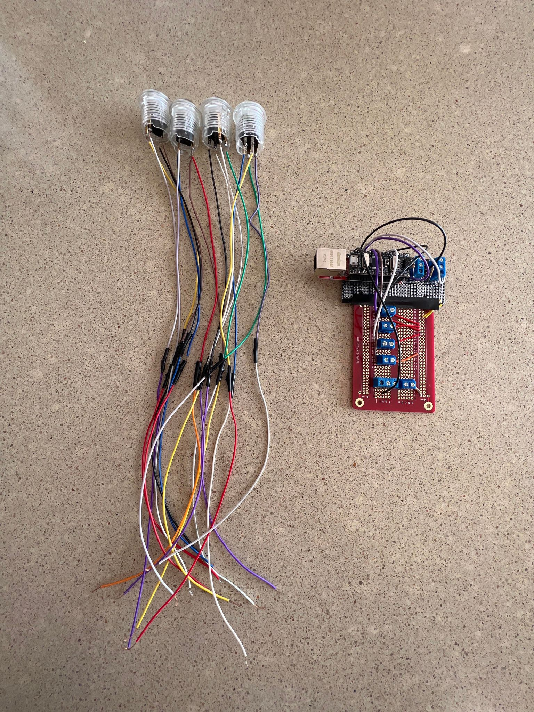
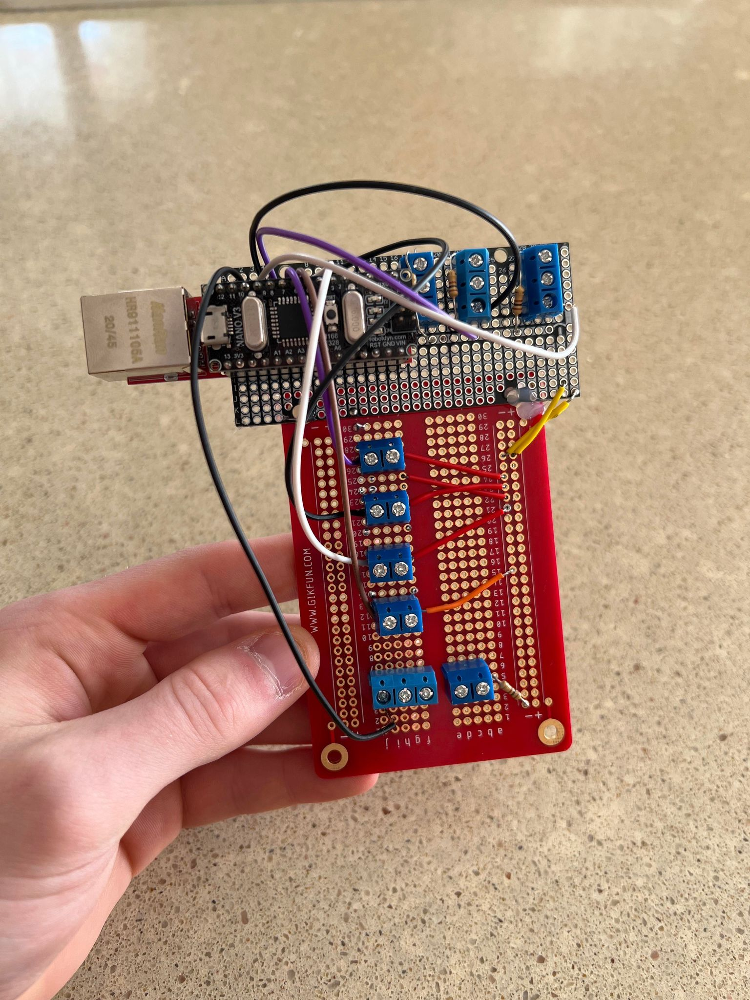
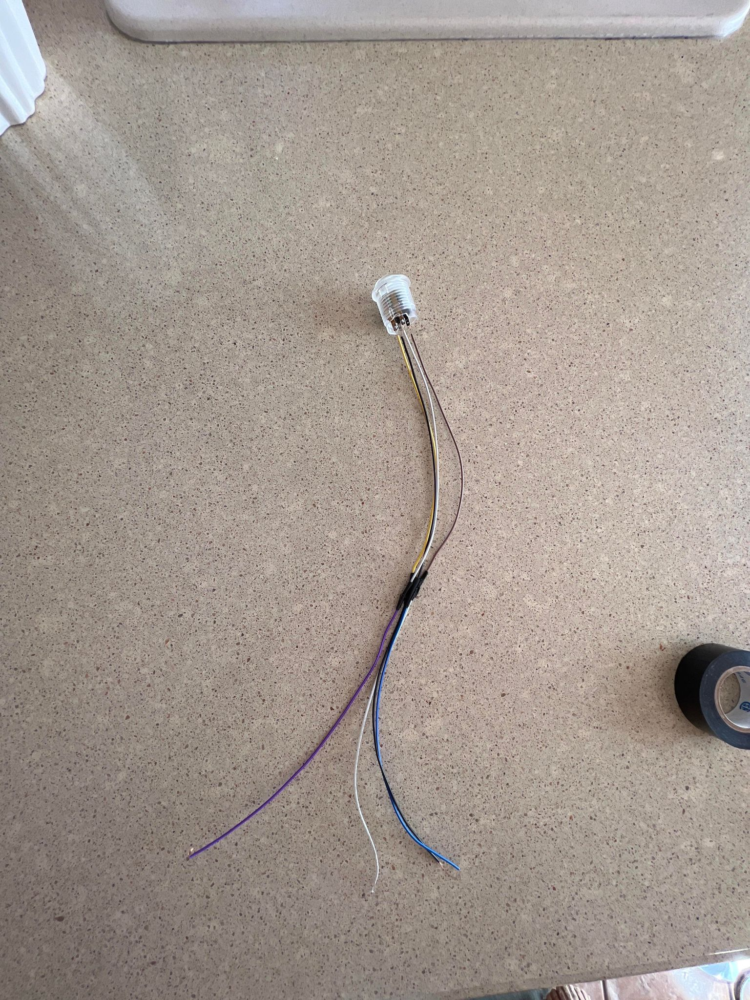

# Journal de Raphaël Fillion

* [Semaine 1](#semaine-1)
* [Semaine 2](#semaine-2)
* [Semaine 3](#semaine-3)
* [Semaine 4](#semaine-4)
* [Semaine 5](#semaine-5)
* [Semaine de rattrapage](#semaine-de-rattrapage)
* [Semaine 6](#semaine-6)
* [Semaine 7](#semaine-7)
* [Semaine 8](#semaine-8)
* [Semaine 9](#semaine-9)

## Semaine 1

### Résumé des réalisations effectuées
- Commencement du journal
- Refonte de la préproduction complète
- Ajout d'un nouveau schéma pour l'installation
- Aide au code Unity
- Création d'un logo et d'une bannière pour le projet

### Image d'une réalisation dont tu es la ou le plus fier
<kbd></kbd>
<kbd></kbd>

### Est-ce que j'ai accompli l'ensemble des tâches et objectifs que je m'étais fixés pour cette semaine?	
- [x] Complètement
- [ ] Assez
- [ ] Peu
- [ ] Pas du tout

#### Décrivez pourquoi.
On avait pour mission cette semaine de vraiment retravaillé la préproduction, car il y avait encore des éléments qui n'était pas clair ou incomplet. On a aussi debogué, avec l'aide de Guillaume, le problème qu'on avait avec les questions qui n'étaient pas linéaire. Pour l'instant, le projet avance bien.

### Mon projet s'est-il réalisé selon l’échéancier prévu?

- [x] Complètement
- [ ] Assez
- [ ] Un peu
- [ ] Pas tout à fait

### Défis pour la prochaine semaine
Faire en sorte de créer toutes les différentes formes de vidéo d'animateur et de pouvoir faire afficher un animateur pour les questions.

---
## Semaine 2
### Résumé des réalisations effectuées
- Création d'un premier vidéo intentions de projet
- Création d'un UI pour le questionnaire
- Création d'un dessin technique pour le podium
- Réalisation d'un Excel qui regroupe l'inventaire digital et matériel de notre expérience

### Image d'une réalisation dont tu es la ou le plus fier
<kbd></kbd>
<kbd></kbd>
<kbd></kbd>
<kbd></kbd>
<kbd></kbd>
<kbd></kbd>
<kbd></kbd>
<kbd></kbd>

### Est-ce que j'ai accompli l'ensemble des tâches et objectifs que je m'étais fixés pour cette semaine?

- [x] Complètement
- [ ] Assez
- [ ] Peu
- [ ] Pas du tout

#### Décrivez pourquoi.
 On voulait vraiment décider cette semaine le design de notre questionnaire au niveau du UI. Je suis très content d'avoir fait ce design, je l'aime beaucoup.

### Mon projet s'est-il réalisé selon l’échéancier prévu?

- [x] Complètement
- [ ] Assez
- [ ] Un peu
- [ ] Pas tout à fait

### Défis pour la prochaine semaine
- Début de programmation du jeu
- Début de programmation d'arduino
- Acheter un tapis, et voir pour l'écran 24"

---
## Semaine 3 
### Résumé des réalisations effectuées
- Création d'un nouveau vidéo d'intentions avec les nouveaux commentaires
- Création d'un nouveau logo et bannière
- Création d'un excel qui va rassembler la plupart de l'équipements nécessaire ainsi que d'inspirations
- Début de l'installation en studio

### Image d'une réalisation dont tu es la ou le plus fier
<kbd></kbd>
<kbd></kbd>

### Est-ce que j'ai accompli l'ensemble des tâches et objectifs que je m'étais fixés pour cette semaine?

- [x] Complètement
- [ ] Assez
- [ ] Peu
- [ ] Pas du tout

#### Décrivez pourquoi.
 On s'avait fixer de faire que quelques corrections, car on voulait avoir les commentaires pour le vidéo d'intentions.

### Mon projet s'est-il réalisé selon l’échéancier prévu?

- [x] Complètement
- [ ] Assez
- [ ] Un peu
- [ ] Pas tout à fait

### Défis pour la prochaine semaine
- Aller continuer l'installation en studio
- Continuer la programmation du questionnaire
- Commencement (peut-être) des vidéos animateurs

---
## Semaine 4
### Résumé des réalisations effectuées
- Continuation de l'installation du studio
- Mapping des projecteurs sur le cyclorama
- Commencement des MAX et WebSocket

### Image d'une réalisation dont tu es la ou le plus fier
***Aucune Image***

### Est-ce que j'ai accompli l'ensemble des tâches et objectifs que je m'étais fixés pour cette semaine?

- [x] Complètement
- [ ] Assez
- [ ] Peu
- [ ] Pas du tout

### Mon projet s'est-il réalisé selon l’échéancier prévu?

- [x] Complètement
- [ ] Assez
- [ ] Un peu
- [ ] Pas tout à fait

### Défis pour la prochaine semaine
- Finition du code MAX et commencement d'intégration avec arduino
- Soudure des boutons d'arcade dans un Arduino
- Commencement d'un prototype de notre expérience complète
---
## Semaine 5
### Résumé des réalisations effectuées
- Installation du podium avec l'écran intégrer
- Cablage des différents dispositifs audios et vidéo
- Finalisation du UI du Jeu
- Début du Max 

### Image d'une réalisation dont tu es la ou le plus fier
<kbd></kbd>
<kbd></kbd>
<kbd></kbd>
<kbd></kbd>

### Est-ce que j'ai accompli l'ensemble des tâches et objectifs que je m'étais fixés pour cette semaine?

- [x] Complètement
- [ ] Assez
- [ ] Peu
- [ ] Pas du tout

### Mon projet s'est-il réalisé selon l’échéancier prévu?

- [x] Complètement
- [ ] Assez
- [ ] Un peu
- [ ] Pas tout à fait

### Défis pour la prochaine semaine
- Soudure du Arduino 
- Continuation du Max
---
## Semaine de rattrapage
### Résumé des réalisations effectuées
- Soudure entière de l'arduino
- Commencement des vidéos d'animateur

### Image d'une réalisation dont tu es la ou le plus fier
<kbd></kbd>
<kbd></kbd>
<kbd></kbd>

### Est-ce que j'ai accompli l'ensemble des tâches et objectifs que je m'étais fixés pour cette semaine?

- [x] Complètement
- [ ] Assez
- [ ] Peu
- [ ] Pas du tout

### Mon projet s'est-il réalisé selon l’échéancier prévu?

- [x] Complètement
- [ ] Assez
- [ ] Un peu
- [ ] Pas tout à fait

### Défis pour la prochaine semaine
- Continuer les vidéos d'animateur
- Faire des simulations de Jeu pour voir si le tout fonctionne
---
## Semaine 6
### Résumé des réalisations effectuées
- Connexion MAX avec Arduino
- Mapping du cyclo en cours
- Début de recheches pour une ambiance sonore

### Image d'une réalisation dont tu es la ou le plus fier
***Aucune Image***

### Est-ce que j'ai accompli l'ensemble des tâches et objectifs que je m'étais fixés pour cette semaine?

- [ ] Complètement
- [x] Assez
- [ ] Peu
- [ ] Pas du tout

#### Décrivez pourquoi.
 On a eu un problème avec arduino, que les connexions avec fils n'étaient pas tous correct. On a beaucoup fait de déboguage à ce sujet, donc on a pas avancé autant qu'on l'espérait. Malgré ça, nous avons réussi finalement à faire la connexion et nous allons pouvoir focuser sur l'ambiance général de notre expérience.

### Mon projet s'est-il réalisé selon l’échéancier prévu?

- [x] Complètement
- [ ] Assez
- [ ] Un peu
- [ ] Pas tout à fait

### Défis pour la prochaine semaine
- Finir Mapping
- Avoir une trame sonore fonctionnelle qui marche avec notre approche de l'expérience
- Faire en sorte d'avoir fini l'expérience pour régler des problèmes potentielles
---
## Semaine 7
### Résumé des réalisations effectuées

### Image d'une réalisation dont tu es la ou le plus fier

### Est-ce que j'ai accompli l'ensemble des tâches et objectifs que je m'étais fixés pour cette semaine?

- [ ] Complètement
- [ ] Assez
- [ ] Peu
- [ ] Pas du tout

#### Décrivez pourquoi.
 

#### S'il y a lieu, qu'allez-vous faire pour remédier à la situation?

### Mon projet s'est-il réalisé selon l’échéancier prévu?

- [ ] Complètement
- [ ] Assez
- [ ] Un peu
- [ ] Pas tout à fait

#### S'il y a des écarts, décrivez-les.

#### S'il y a lieu, qu'allez-vous faire pour remédier à la situation?

### Défis pour la prochaine semaine

## Semaine 8

## Semaine 9
