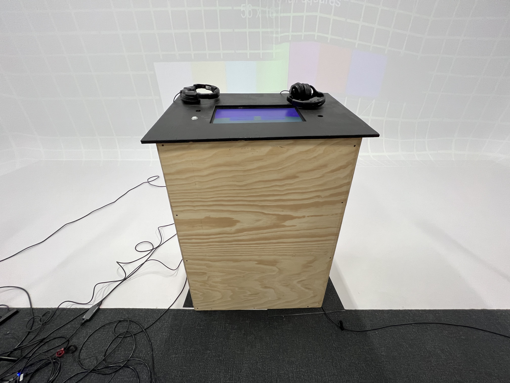

# Journal de Philippe Trudel

* [Semaine 1](#semaine-1)
* [Semaine 2](#semaine-2)
* [Semaine 3](#semaine-3)
* [Semaine 4](#semaine-4)
* [Semaine 5](#semaine-5)
* [Semaine de rattrapage](#semaine-de-rattrapage)
* [Semaine 6](#semaine-6)
* [Semaine 7](#semaine-7)
* [Semaine 8](#semaine-8)
* [Semaine 9](#semaine-9)

## Semaine 1

### Résumé des réalisations effectuées
- Première rencontre de la session. Création de ce journal de bord.
- Ré-écriture de la préproduction (Intention et conception à Contenu de multimédia à intégrerS)
- Comprendre et corriger un problème dans Unity C#.
- Réécriture des questions pour le jeu.

### Image d'une réalisation dont tu es la ou le plus fier

et

### Est-ce que j'ai accompli l'ensemble des tâches et objectifs que je m'étais fixés pour cette semaine?	
- [ ] Complètement
- [x] Assez
- [ ] Peu
- [ ] Pas du tout

#### Décrivez pourquoi.
Tout ce qui est écriture ou réécriture de la préproduction a été sans aucun problème. Je dirais que réécrire les quinze nouvelles questions pour le jeu a été moyennement compliqué, mais je ne cacherai pas que corriger et comprendre le langage de programmation C# est assez complexe pour mon niveau et est donc plus difficile à accomplir sans embûches et dans un délai raisonnable. Nous avons eu l'aide de notre professeur Guillaume à quelques reprises afin de comprendre et d’avancer tranquillement dans notre projet Unity, mais avec quelques problèmes.

#### S'il y a lieu, qu'allez-vous faire pour remédier à la situation?
Principalement, je dois effectuer des recherches avec des tutoriels, google et demander aux professeurs des questions sur le code C# et les fonctions d'Unity. Notre projet est un peu au-dessus de notre niveau technique en termes de langage de programmation, mais je crois que c'est un bon défi et qu'on peut le réaliser. Il faut juste comprendre et avoir de l'aide afin que tout se passe bien et que l'on réussisse à obtenir un produit final.

### Mon projet s'est-il réalisé selon l’échéancier prévu?

- [ ] Complètement
- [x] Assez
- [ ] Un peu
- [ ] Pas tout à fait

#### S'il y a des écarts, décrivez-les.
Les quelques écarts sont reliés à la première version alpha de notre projet Unity. Pour le moment, nous n’avons que 15 questions qui fonctionnent avec une bande sonore, un fonctionnement de progression linéaire et des effets sonores pour l'activation des bonnes et mauvaises réponses.

#### S'il y a lieu, qu'allez-vous faire pour remédier à la situation?
Nous devons progressivement améliorer notre projet actuel afin de nous diriger vers le produit final.

### Défis pour la prochaine semaine
Nos défis et nos objectifs pour la semaine prochaine vont être de rajouter des vidéos d'animations selon le score inscrit par le joueur. En d'autres mots, faire en sorte que plus le nombre de questions avance, plus nous pouvons suivre la progression dans le score et utiliser ces données afin de jouer des vidéos d'animations et interagir avec le joueur.

---
## Semaine 2
### Résumé des réalisations effectuées
- Première rencontre avec les professeurs le mercredi.
- Création de la vidéo des intentions
- Changement de technologie de Unity --> HTML.
- Correction pré-production (Intro/Conclusion, Définition de l'animateur, etc.)
- Début de la programmation HTML/CSS/JS en préparation pour les prochaines semaines.

### Image d'une réalisation dont tu es la ou le plus fier

et

### Est-ce que j'ai accompli l'ensemble des tâches et objectifs que je m'étais fixés pour cette semaine?

- [ ] Complètement
- [x] Assez
- [ ] Peu
- [ ] Pas du tout

#### Décrivez pourquoi.
 J'avais comme objectif de commencer à rajouter des vidéos d'animations selon le score et avec le changement de technologie et aussi la correction de la pré-production et de la vidéo de présentation, je n'ai pas autant avancé que je l'aurais voulu.

#### S'il y a lieu, qu'allez-vous faire pour remédier à la situation?
Je crois que je devrais me donner des objectifs et des tâches qui répondent plus à mes attentes et qui rentre dans mon horaire de préproduction et réalisation pour les prochaines semaines.

### Mon projet s'est-il réalisé selon l’échéancier prévu?

- [x] Complètement
- [ ] Assez
- [ ] Un peu
- [ ] Pas tout à fait

#### S'il y a des écarts, décrivez-les.
Pour ce qui est de la préproduction, de la création de la vidéo de présentation et des intentions et de la correction de celle-ci après notre rencontre hebdomadaire, tout fut corriger et donc le projet de cette semaine a été réalisé selon l'échéancier prévu.

### Défis pour la prochaine semaine
Si nous débutons la réalisation à partir de la semaine 3, mon défi sera de faire en sorte que le site web de la présentation exécute le quiz en javascript. En d'autres mots, j'aimerais programmer en javascript le quiz pour qu'on puisse faire de la question 1 à 15.

---
## Semaine 3 
### Résumé des réalisations effectuées
- Création d'un nouveau vidéo d'intentions avec les nouveaux commentaires
- Participation à la première rencontre du comité Communication
- Début de la programmation du Quiz en Javascript

### Image d'une réalisation dont tu es la ou le plus fier
<kbd></kbd>
<kbd></kbd>

### Est-ce que j'ai accompli l'ensemble des tâches et objectifs que je m'étais fixés pour cette semaine?

- [x] Complètement
- [ ] Assez
- [ ] Peu
- [ ] Pas du tout

#### Décrivez pourquoi.
 Nous avons corriger et améliorer notre préproduction finale pour la remise et j'ai personnellement bien commencé et avancé dans ma programmation de mes questions et le scripte qui est établie pour le jeu.

### Mon projet s'est-il réalisé selon l’échéancier prévu?

- [x] Complètement
- [ ] Assez
- [ ] Un peu
- [ ] Pas tout à fait

### Défis pour la prochaine semaine
- Continuer la programmation du questionnaire.
- Corriger les erreurs de programmation.
- Intégrer les sons dans le questionnaire.
---
## Semaine 4
### Résumé des réalisations effectuées
- Réparation de problème Javascript
- Installation haut-parleurs
- Intégration sons dans le questionnaire

### Est-ce que j'ai accompli l'ensemble des tâches et objectifs que je m'étais fixés pour cette semaine?

- [x] Complètement
- [ ] Assez
- [ ] Peu
- [ ] Pas du tout

#### Décrivez pourquoi.
 J'ai passé la fin de semaine à réglé les problèmes de Javascript avec l'aide d'un ami qui travaille dans le domaine et aussi avec l'aide d'un professeur du cégep. J'ai donc réussi à faire deux défis pour cette semaine, qui était : Faire la réparation de mon problème Javascript et aussi faire l'intégration de sons dans le questionnaire. J'ai aussi participé avec Raphaël à l'installation des haut-parleurs dans le grand studio.

### Mon projet s'est-il réalisé selon l’échéancier prévu?

- [x] Complètement
- [ ] Assez
- [ ] Un peu
- [ ] Pas tout à fait

### Défis pour la prochaine semaine
- Faire du prototypage avec Max et Websocket
- Améliorer le questionnaire avec une fin
- Enregistrer certaines vidéos + audio
---
## Semaine 5
### Résumé des réalisations effectuées
- Câblage et installation podium dans le cyclo
- Réparation et avancement de MaxWebSocket et du questionnaire

### Image d'une réalisation dont tu es la ou le plus fier
<kbd></kbd>
<kbd></kbd>
<kbd></kbd>
<kbd></kbd>

### Est-ce que j'ai accompli l'ensemble des tâches et objectifs que je m'étais fixés pour cette semaine?

- [ ] Complètement
- [x] Assez
- [ ] Peu
- [ ] Pas du tout

#### Décrivez pourquoi.
 Nous n'avons pas eu le temps d'entamer la création de contenu (vidéo et audio) cette semaine. Nous avons plutôt accordé notre attention sur tout l'aspect technique dans le grand studio afin de finir les connexions de fils et que tout soit prêt pour les test lors des prochaines semaines.

### Mon projet s'est-il réalisé selon l’échéancier prévu?

- [ ] Complètement
- [x] Assez
- [ ] Un peu
- [ ] Pas tout à fait

#### S'il y a des écarts, décrivez-les.
Nous devons finir les connexions Max, Websocket et Arduino.

### Défis pour la prochaine semaine
- Arduino
- Max
---
## Semaine de rattrapage
### Résumé des réalisations effectuées
- Avancement Max et Websocket
- Finissions podium
- Changement Menu d'intro du questionnaire

### Est-ce que j'ai accompli l'ensemble des tâches et objectifs que je m'étais fixés pour cette semaine?

- [ ] Complètement
- [x] Assez
- [ ] Peu
- [ ] Pas du tout

### Mon projet s'est-il réalisé selon l’échéancier prévu?

- [ ] Complètement
- [x] Assez
- [ ] Un peu
- [ ] Pas tout à fait

### Défis pour la prochaine semaine
- Commencer les test dans le grand studio
---
## Semaine 6
### Résumé des réalisations effectuées
- Création de la bande sonore
- Création vidéos fin

### Est-ce que j'ai accompli l'ensemble des tâches et objectifs que je m'étais fixés pour cette semaine?

- [x] Complètement
- [ ] Assez
- [ ] Peu
- [ ] Pas du tout

### Mon projet s'est-il réalisé selon l’échéancier prévu?

- [x] Complètement
- [ ] Assez
- [ ] Un peu
- [ ] Pas tout à fait

### Défis pour la prochaine semaine
- Test grand studio et salle des matrices
- Javascript points + conclusion
---
## Semaine 7
### Résumé des réalisations effectuées
- Modification video fins
- Modification des chansons
- Déplacement du matériel dans la salle des matrices
- Finissions du projet

### Est-ce que j'ai accompli l'ensemble des tâches et objectifs que je m'étais fixés pour cette semaine?

- [x] Complètement
- [ ] Assez
- [ ] Peu
- [ ] Pas du tout

### Mon projet s'est-il réalisé selon l’échéancier prévu?

- [x] Complètement
- [ ] Assez
- [ ] Un peu
- [ ] Pas tout à fait

### Défis pour la prochaine semaine
- Faire des test
- Présentation finale

## Semaine 8
### Résumé des réalisations effectuées
- Dernières corrections de bogues
- Installation dans la salle des matrices le jeudi

### Image d'une réalisation dont tu es la ou le plus fier
***Aucune Image***

### Est-ce que j'ai accompli l'ensemble des tâches et objectifs que je m'étais fixés pour cette semaine?

- [x] Complètement
- [ ] Assez
- [ ] Peu
- [ ] Pas du tout

### Mon projet s'est-il réalisé selon l’échéancier prévu?

- [x] Complètement
- [ ] Assez
- [ ] Un peu
- [ ] Pas tout à fait

### Défis pour la prochaine semaine
- Présentation de l'expérience

## Semaine 9
### Résumé des réalisations effectuées
- Installation terminé
- Correction de bogues
- Présentation du projet lors du vernissage

### Est-ce que j'ai accompli l'ensemble des tâches et objectifs que je m'étais fixés pour cette semaine?

- [x] Complètement
- [ ] Assez
- [ ] Peu
- [ ] Pas du tout

### Mon projet s'est-il réalisé selon l’échéancier prévu?

- [x] Complètement
- [ ] Assez
- [ ] Un peu
- [ ] Pas tout à fait
