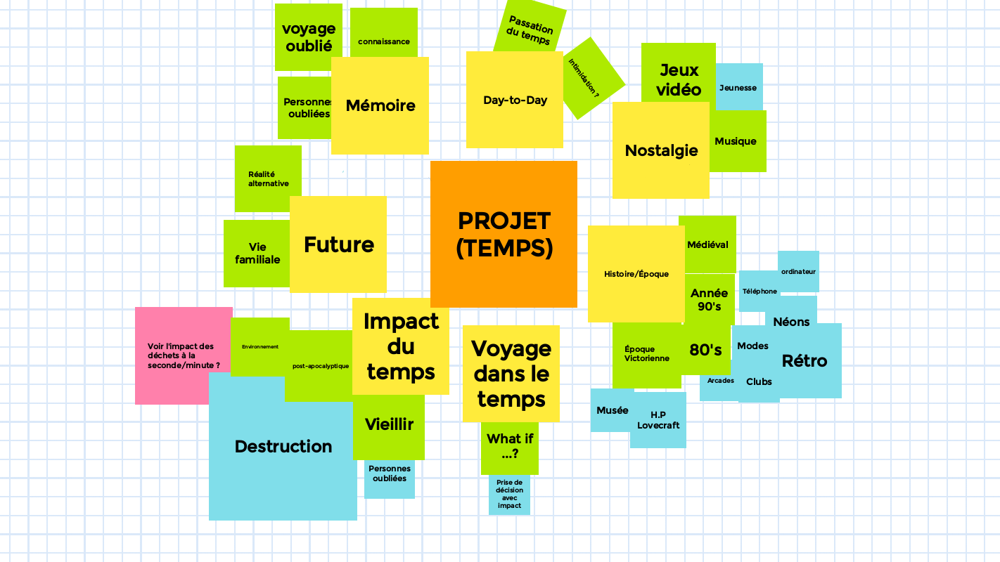
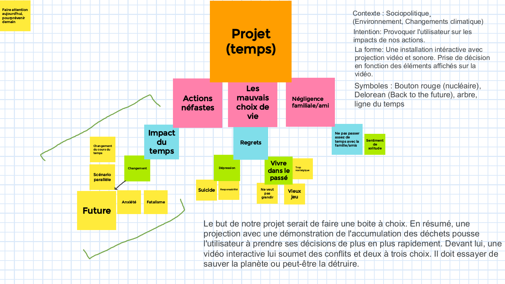
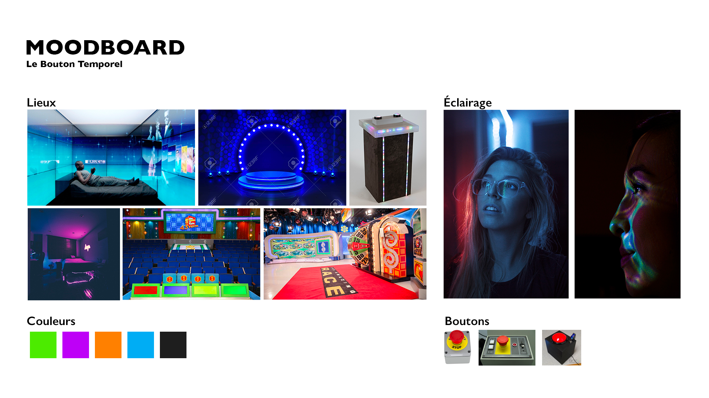
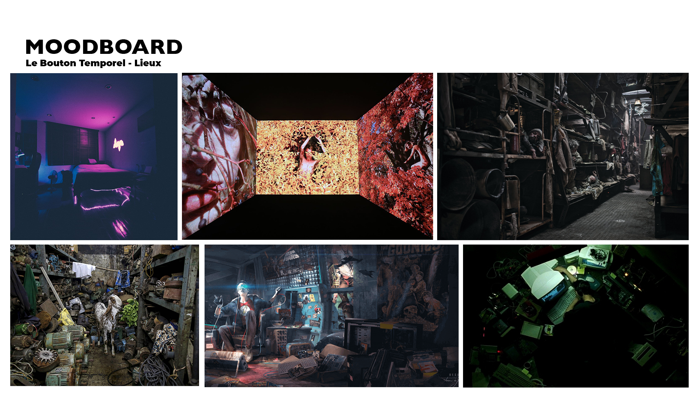
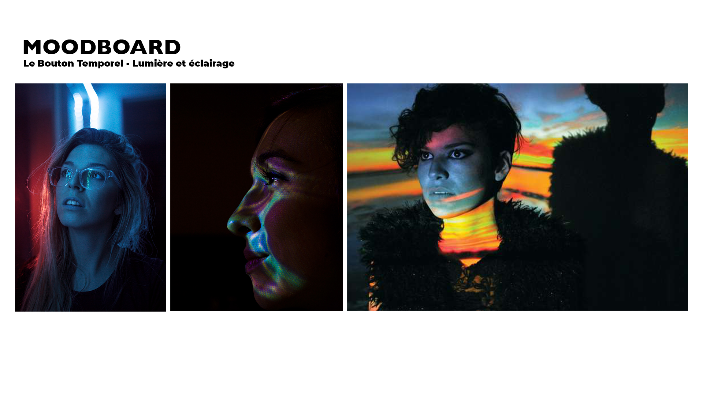
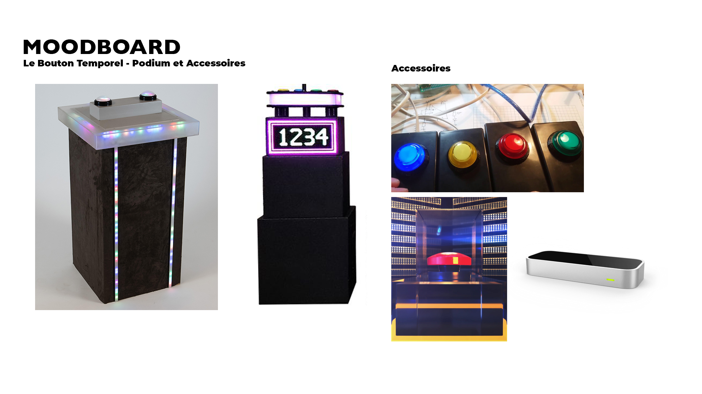
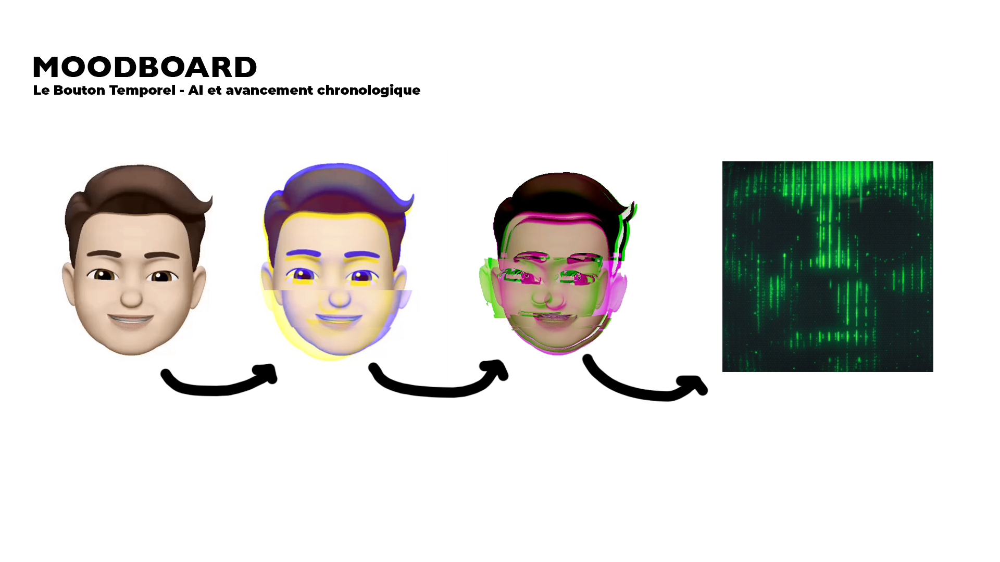
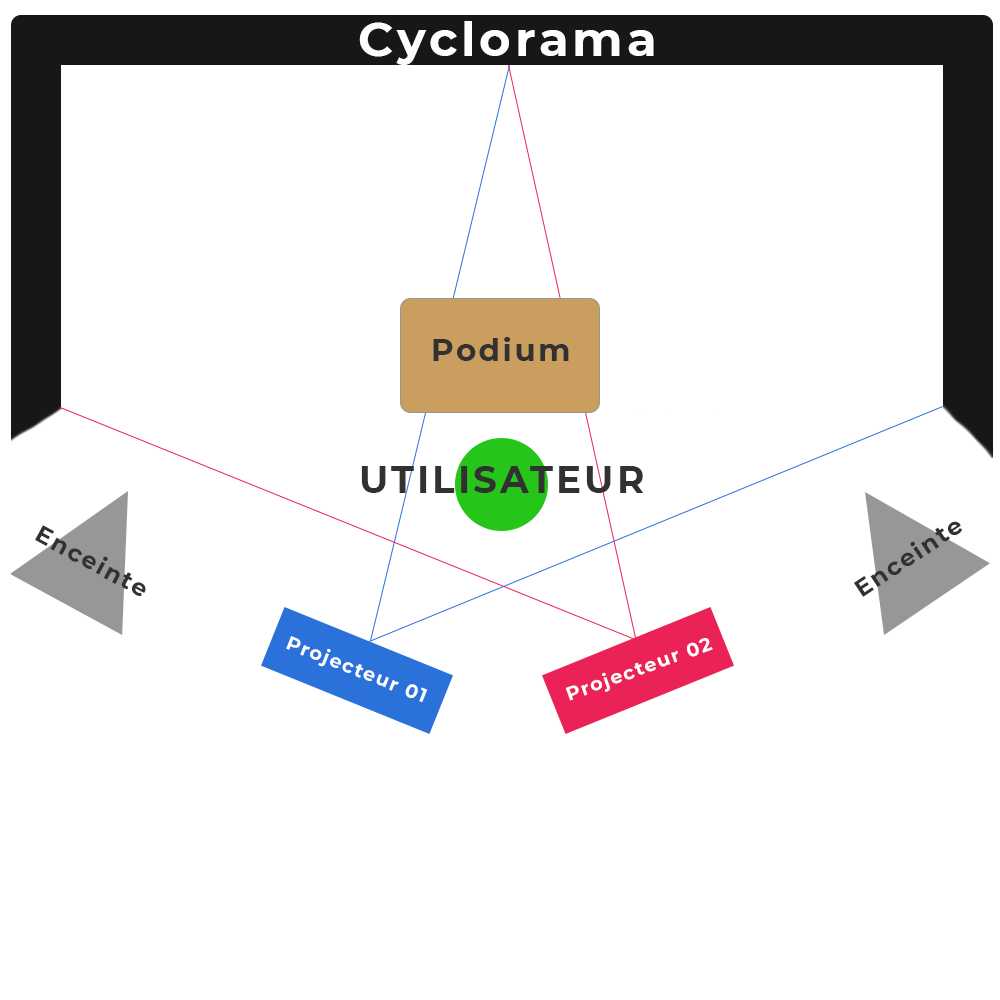
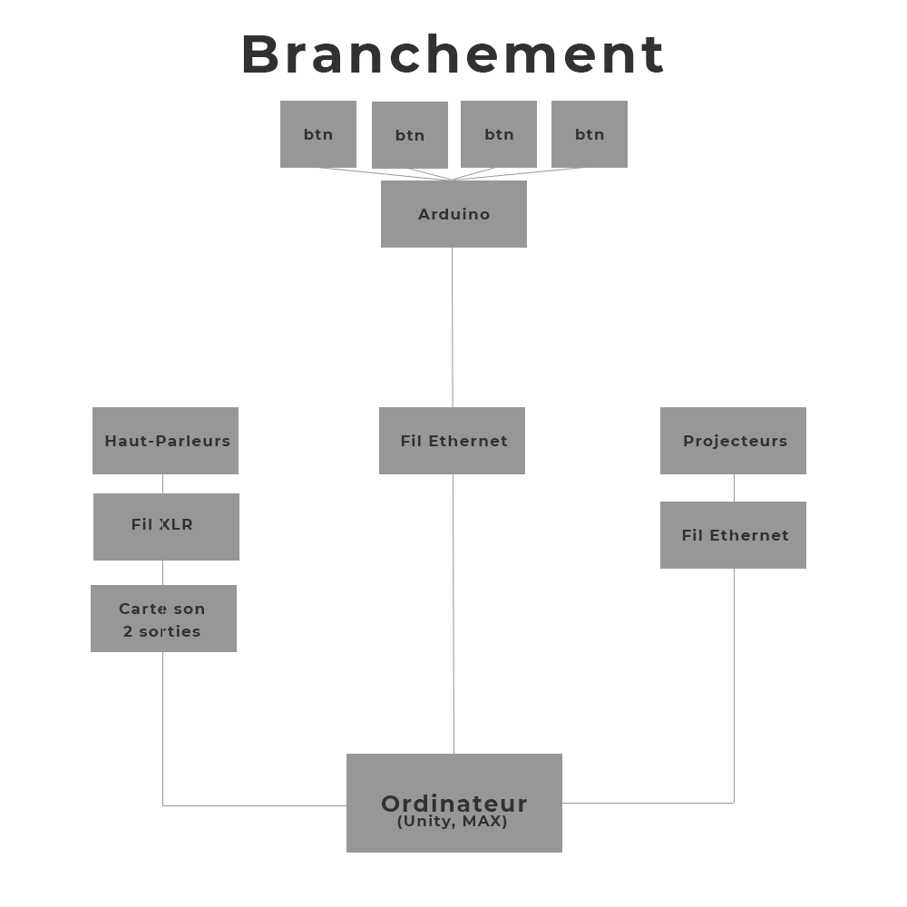

# Préproduction
> Nous afficherons les détails de notre préproduction et aussi le développement de notre projet.

# Table des matières
1. [Intention ou concept](#Intention-ou-concept)
    - [Cartographie](#Cartographie)
    - [Intention de départ](#Intention-de-départ)
    - [Synopsis](#Synopsis)
    - [Tableau Ambiance](#Tableau-Ambiance)
    - [Description de l'expérience](#Description-experience)
    - [Contenu de multimédia à intégrer](#Contenu-de-multimédia-à-intégrer)
2. [Planification technique d'un prototype (devis technique)](#Planification-technique-(devis-technique))
    - [Matériaux requis](#Matériaux-de-scénographie-requis)
    - [Équipements requis](#Équipements-requis)
    - [Logiciels requis](#Logiciels-requis)
    - [Ressources humaines requises](#Ressources-humaines-requises)
    - [Ressources spatiales requises (rangement et locaux)](#Ressources-spatiales-requises-(rangement-et-locaux))
    - [Contraintes techniques et potentiels problèmes de production](#Contraintes-techniques-et-potentiels-problèmes-de-production)
3. [Planification de la production d'un prototype (budget et étapes de réalisation)](#Planification-de-la-production-(budget-et-étapes-de-réalisation))
    - [Budget prévisionnel](#Budget-prévisionnel)
    - [Échéancier global](#Échéancier-global)
    - [Liste des tâches à réaliser](#Liste-des-tâches-à-réaliser)
    - [Rôles et responsabilités des membres de l'équipe](#Rôles-et-responsabilités-des-membres-de-l'équipe))
    - [Moments des rencontres d'équipe](#Moments-des-rencontres-d'équipe) 

# Intention ou concept
## Cartographie
> Nos Cartes heuristiques

## Premier remue-méninge
<kbd></kbd> 
  

## Deuxième remue-méninge
<kbd></kbd>
  

## Intention de départ
Nous souhaitons sensibiliser la génération actuelle sur les conséquences écologiques de nos actions pour le futur. Nous voulons également que notre expérience puisse faire réagir l'utilisateur sur l'importance de l'environnement et susciter son action.

### **Qu'est-ce que notre projet fait voir plus que les autres?** 
>Nous ne croyons pas que notre projet ce veut plus grand ou meilleure que les autres. Nous croyons simplement que les problématiques et les crises climatiques sont un sujet assez important, et qu'il est critique d'aborder le sujet sur une autre plateforme. Notre projet fait participer le ou les participants dans un jeu qui veut faire réaliser et voir les impacts de nos choix individuel et en tant que société dans cette crise climatique.

## Synopsis
Une personne est invité à faire une expérience intéractive sur le sujet de l'environnement et changements climatique. Cette personne entre dans le jeu télévisé fictif *Jeu Temporel* pour montrer son talent, mais le jeu s'avère être une critique du mode de vie de notre époque et d'un cri d'alarme pour le future qui s'en vient. Plusieurs fins différentes peuvent arriver et le joueur, et ses choix, peut réussir à vivre une fin heureuse ou désastreuse.

# Tableau Ambiance
### Moodboard général
<kbd></kbd>

### Moodboard Lieux
<kbd></kbd>

### Moodboard Lumière et éclairage
<kbd></kbd>

### Moodboard Podium et Accessoires
<kbd></kbd>

### Moodboard AI
<kbd></kbd>

### Moodboard Son et Musique

| Titre | Utilisation |
|--------------------------------------------------|-------------------------------------------------------|
| musique01.mp3 | Musique de fond, aime le synth et la lenteur |
| musique02.mp3 | Musique de fond, aime le synth et la lenteur |
| musique03.mp3 | Musique de fond, aime le synth et la lenteur |
| bing.wav | Utilisation lors d'une bonne réponse |
| good.wav | Utilisation lors d'une bonne réponse |
| wrong.wav | Utilisation lors d'une mauvaise réponse |
| soundtrack.wav | Bande-Sonore |

### Allison Moore ###
<kbd></kbd>

Les projets de l'artiste Allison Moore utilisent à plusieurs reprises des projections sur plusieurs murs et dans des pièces dédiées aux projections. Nous voulons principalement imité ces procédures-là pour notre projet.

# Description de l'expérience
La curiosité du jeu va pousser le ou les intéracteurs à jouer et participer au questionnaire pour voir leurs niveaux de connaissances sur l'environnement. Le jeu se transforme pour faire un parallèle avec les changements climatiques rapides qui vont arriver dans les prochaines années (ex: le jeu devient de plus en plus du style 'noir').

La transformation mentionné plus haut s'apparente avec une modification tout au long du jeu; changements visibles de l'animateur, questions avec une connotation plus prononcée d'humour noir, changement dans le chronomètre, etc. Ceci a pour effet de changer l'humeur général de la présentation d'un niveau de naïveté, vers du sérieux. La transformation indique aussi une métaphore du changement climatique, que plus le temps avance, plus les changements sont perceptible et tangible.

## *Ambiance*
Le visuel devant l'expérience serait de montrer en facade de la couleur, une musique agréable, un thème de fête. La personne qui va faire l'expérience va donc avoir des attentes différentes à ce qu'il va vivre durant le jeu. On veut vraiment faire ressentir à l'intéracteur le changment d'ambiance tout au long de l'expérience.

Il va y avoir un animateur qui va, tout au long de l'expérience, changer d'apparence selon où l'intéracteur est rendu. Il va aussi avoir des 'glitchs' pour renforcer l'idée que l'expérience se transforme.

## *Message*
À mesure que les questions défilent, le temps s'accélère et les questions deviennent sérieuse, au point tel que les réponses que l'utilisateur donne peut massacrer ou non le futur. À la fin du jeu, on peut voir si l'utilisateur à détruit ou sauver la planète terre, et par quel moyen.

Le message ce veut comme étant une ouverture de la réalité des changements climatiques maintenant et des conséquences futurs. Nous voulons simplement faire comprendre et montrer les réalités confirmées à venir avec les changements climatiques.

## *Questions*
Nous allons poser une dizaine ou une quinzaine de questions au joueur, du plus facile au plus difficile. Nous voulons autant toucher les émotions que l'humour en passant par des décisions moraux. Le tout sera accompagné d'une chronomètre projeté à gauche et d'un animateur à droite.

Suivant ces questions, l'animateur fera des commentaires envers le participant selon la réponse qu'il ou elle choisit;

- ### Questions
    >Questions facile
    - _1- À quel point êtes vous préoccupez par l'environnement?_
        - Très peu 
        - Pas beaucoup
        - Moyennement
        - Vraiment trop <!--Bonne réponse-->

    **Animateur :**

        - Bonne réponse : "Aaaah je vois que tu es une bonne personne, sûrement que ce questionnaire va être simple pour toi!" 

        - Mauvaise réponse : "Oh.. ça commence mal."
    - _2- Quelle a été, selon vous, l'année la plus chaude de l'histoire?_
        - 1946 
        - 2003
        - 2016
        - 2018 <!--Bonne réponse-->
    
    **Animateur :** 

        - Bonne réponse : "En effet! 2018 a été l'année la plus chaude avec un record de 14.7 degré global."

        - Mauvaise réponse : "ahahahah bonne tentative, mais non."
    - _3- Entre 1990 et 2016, quelle est la part des catastrophes liées aux changements climatiques dans la totalité des catastrophes naturelles dans le monde?_
        - 20% 
        - 50%
        - 70% <!--Bonne réponse-->
        - 100%
    
    **Animateur :** 
    
        - Bonne réponse : "Tu es pile poils dessus la réponse. 70% des catastrophes mondiales sont reliés de près ou de loin aux changements climatiques."

        - Mauvaise réponse : "Tu as essayer de deviner par hasard ou quoi? Eh non, la bonne réponse était 70%"
    - _4- La température moyenne a augmenté de combien depuis l'ère industrielle?_
        - 1 degré C <!--Bonne réponse-->
        - 5 degré C
        - 0.1 degré C 
        - N'a pas augmenté
    
    **Animateur :** 
    
        - Bonne réponse : "Oui! Seulement 1 degré peut sembler peu, mais ceci change drastiquement l'écosystème de notre planète vers le négatif."

        - Mauvaise réponse : "Aïe aïe aïe, j'espère que tu ne crois pas que la température moyenne est rester la même depuis 200 ans j'espère ?"
    - _5- Dans combien d'année la guerre du pétrole devrait commencer?_
        - 10 ans 
        - 50 ans <!--Bonne réponse-->
        - 75 ans 
        - 100 ans
    
    **Animateur : (début du glitch)** 
    
        - Bonne réponse : "Tu sembles être au courant de notre future saturation de pétrole...(glitch) En 2070, il faudra se préparé."

        - Mauvaise réponse : "La naïveté te garde en sécurité, mais non. Les experts prévoient qu'en 2070, il ne restera plus de pétrole dans nos réserves."
    - _6- Selon les Québécois, quelle est la raison principale qui les pousse à gaspiller des aliments?_
        - Le respect des dates de péremption <!--Bonne réponse-->
        - Le trop grand format de certains aliments vendus en épicerie
        - Ils manquent de temps pour cuisiner
        - Ils manquent de connaissances pour mieux conserver les aliments
    
    **Animateur :** 
    
        - Bonne réponse : 

        - Mauvaise réponse : 
    - _7- Quelles activités sont les plus gros contributeurs de gaz à effet de serre ?_ 
        - La déforestation
        - La production d'électricité<!--Bonne réponse-->
        - Hollywood
        - L'agriculture
    
    **Animateur :** 
    
        - Bonne réponse : "On aurait pu penser à la déforestation et l'agriculture, mais c'est bien la production d'électricité par combustion de pétrole, gaz naturelle et charbon qui contribue le plus aux gaz à effet de serre."

        - Mauvaise réponse : "pffft, tu pensais certainement pas que Hollywood était responsable des gaz à effet de serre ? Je vais te donner le bénéfice du doute, pour l'instant"
    - _8- Alors que des millions de personnes ont faim sur la planète, quelle proportion de nourriture se retrouve chaque année dans les poubelles?_
        - Un 10e de la production mondiale.
        - Un quart de la production mondiale.
        - Un tiers de la production mondiale. <!--Bonne réponse-->
        - 50% de la production mondiale.
    
    **Animateur :** 
    
        - Bonne réponse : "1/3 de la production de nourriture mondiale se retrouve dans les poubelles et les sites d'enfouissement..c'est énormément de gaspillage."

        - Mauvaise réponse : "Siii près de la réponse. Je dois avouer que ça devient difficile de connaître exactement au poid précis, combien de nourriture nous jettons par année."
    - _9- De quel grosseur est l'île de déchet qui flotte dans l'océan Pacifique ?_ <!--Réponse-->
        - 1000 k㎡
        - 10 000 k㎡
        - 1.6 millions k㎡
        - 5 millions k㎡
    
    **Animateur :**
    
        - Bonne réponse : "1 point 6 millions de km carré. C'est aussi gros que le Texas en superficie. Et c'est seulement des déchets!!"

        - Mauvaise réponse : "Eeeeh non. La bonne réponse était 1.6 millions de km carré. Aussi gros que le Texas en superficie de déchet au carré. Ça fait beaucoup de déchet."
    - _10- Avec les changements climatiques, quelles catastrophes allons nous appercevoir régulièrement au Québec à partir de 2035?_ <!--Réponse-->
        - Des tremblements de terre à Tremblant.
        - Des Ouragans aux Iles-de-la-Madeleine. <!--Bonne réponse-->
        - Un volcan sur le Mont-Royale.
        - Un désert à Venise-en-Québec
    
    **Animateur :** 
    
        - Bonne réponse : "Ça peut sembler surprenant, mais selon Radio-Canada, le réchauffement et l'augmentation des précipitations, le climat du golf du St-Laurent sera propice aux Ouragans dans quelques années."

        - Mauvaise réponse : "J'avoue que tout ces choix semblent farfelue, mais c'est bien une réalité qui s'en vient si nous ne faisons pas des changements drastiques dans nos modes de vie... ou bien il est temps d'investir dans un parapluie et des bonnes bottes de pluie."
    - _11- Combien de gens mouront des changements climatiques?_ <!--Réponse-->
        - 36 millions, la population du Canada en 2021.
        - 81 millions, la population de l'Allemagne en 2021. <!--Bonne réponse-->
        - 365 millions, la population des États-Unis en 2021.
        - 1,38 milliard, 1/7e de la population mondiale.
    
    **Animateur :** 
    
        - Réponse : "Données troublantes, mais des estimations prévoit que 81 millions de personnes, soit la population de l'Allemagne, mourront des conséquences des changements climatiques."
    - _12- Quel serait le moyen le plus efficace de réduire les gaz à effet de serre?_ <!--Réponse-->
        - Détruire l'industrie pétrolière.
        - Adopter le véganisme de force.
        - Faire une révolution anti-capitalisme et bannir les multinationales et les riches.
        - Toute ces réponses.
    
    **Animateur :** 
    
        - Réponse : 
    - _13- À quel point serais-tu prêt à être déplacer de force lorsqu'il y aura des inondations chaques années ?_ <!--Réponse-->
        - Très peu
        - C'est pas mon problème
        - Je vais juste mettre des sacs de sable
        - Je suis prêt à faire le nécessaire
    
    **Animateur :** 
    
        - Bonne réponse : 

        - Mauvaise réponse : 
    - _14- Serez-vous prêt à faire la guerre pour de l'eau potable?_ <!--Réponse-->
        - Aux armes!
        - Non
        - Je vais boire de la boisson gazeuse.
        - Où est le vaisseau pour mars..?
    
    **Animateur :** 
    
        - Réponse : 
    - _15- Quel est le pays qu'on devrait se débarasser pour vaincre la crise du climat_ 
        - États-Unis.
        - Chine.
        - Inde.
        - On commence une guerre nucléaire et on rase les humains de la terre.

    **Animateur :** 
    
        - Bonne réponse : "Bon choix. C'est ce que nous devons faire. J'entâme le lancement. Ceci n'est pas un test. 3...2...1.."
    

Sources : 
 * https://cleanet.org/clean/literacy/climate/quiz.html
 * https://www.earthday.org/the-climate-change-quiz/

# Contenu de multimédia à intégrer
## Inventaire du contenu multimédia

- Interface de questionnaire (Fait sur Illustrator)
- 2 Effets sonores (Bonne/mauvaise réponse)
- 30 animations de personnages fait avec Memoji et After Effect
- Effets de glitch sur Unity
- Quinzaine de question
- 2 Projecteurs
- 3 Spots de lumières
- 5 mètres de cable LED
- 1 Podium
- 4 Boutons d'arcades
- 1 paysage sonore (Bande sonore)

# Planification technique d'un prototype (devis technique)
> ## Plans techniques
### Plantation 
<kbd></kdb>
 

### Branchement 
<kbd></kdb>
 

## Matériel de scénographie requis
* Podium

## Équipements requis**

* Audio
    * 2 haut-parleurs actifs de 4"
    * 2 fils XLR 3 conducteurs de 15' (M->F)
    * Interface audio USB disposant 2 sorties 

* Vidéo
    * 2 projecteurs vidéo lentille standard
    * 2 systèmes d'acrochage

* Lumière
    * 2 projecteurs lumières

* Électronique
    * 1 Arduino
    * 4 Boutons d'arcade

* Électricité
    * 2 cordons IEC (pour l'alimentation des haut-parleurs)
    * 2 extentions

* Ordinateur
    * 1 ordinateur portable puissant ou ordinateur desktop

## Logiciels requis
* [Max 8](https://cycling74.com/products/max)   
* [Unity](https://unity.com/)
* [Arduino](https://www.arduino.cc/)
* [MadMapper](https://madmapper.com/)
* [OBS](https://obsproject.com/)
* [Adobe After Effect](https://www.adobe.com/ca_fr/products/aftereffects.html)

## Ressources humaines requises

* TTP, location de matériel
* Guillaume Arsenault pour les projecteurs, le matériel physique ainsi que le code pour certaines fonctionnalitées.
* Thomas Ouellet Fredericks pour l'espace interactif, la programmation Arduino et autres.
* Daryl Hubert pour la conception et aide supplémentaire tout au long de la création de ce projet multimédia.

## Ressources spatiales requises (rangement et locaux)

*  Grand Studio - Cyclorama
    * Projection entière du cyclorama
    * Audio stéréo devant l'utilisateur

## Contraintes techniques et potentiels problèmes de production

| Contrainte ou problème potentiel                 | Solution envisagée                                    | Commentaires                                                                                 |
|--------------------------------------------------|-------------------------------------------------------|----------------------------------------------------------------------------------------------|
| Utilisation de LeapMotion | Demandé à Xavier ou tout autre personne qualifié | L'utilisation du LeapMotion semble quand même facile à intégrer avec plusieurs tutoriels en ligne, mais avoir une formation supplémentaire serait intéressante  |
| Insertion de la bonne vidéo d'animateur pour chaque question      | Utilisé le même principe qu'on a vu en Réalité Virtuelle, à la mort du joueur, faire apparaître une fenêtre canvas, mais adapté avec un vidéo | Recherche et développement, un sujet à réfléchir |
| Incapable d'installer Unity ou Leapmotion sur les ordinateurs     | Faire une demande au TTP |  |
| LeapMotion trop compliqué à intégrer | Utilisation d'Arduino pour la selection des questions | Nous allons faire la connexion Arduino vers unity pour faire les selections des questions |
| Avoir des événements qui trigger quand une certaine réponse est sélectionner | Regarder des tutoriels ou demander de l'aide aux personnes concernées | Pour l'instant nous avons pas essayé de faire marcher les différents éléments que nous avons en tête, mais allons faire le suivi dans notre journal pour la suite. |
| Cliquer sur un bouton Arduino pour actionner un bouton virtuel unity | Regarder comment simuler un bouton virtuel avec un bouton physique, à place d'avoir un clique de souris | Pour l'instant, nous étions pas capable de faire en sorte que le clique du bouton d'arcade Arduino simule un clique pour la sélection de question. |

# Planification de la production d'un prototype (budget et étapes de réalisation)

## Budget prévisionnaire

| | Dépenses                                  |   |   | Prix $ |
|----------|----------------------------------|---|---|----|
|          | Construction des décors (Podium) |   |   |    |
|          |  | Bois  |   | 50 |
|          |  | Drap pour couvrir le podium  |   | 10 |
|          | Autres dépenses |  |  |  |
|          |  | Fils à soudure |  | ? |
|          | *Total Dépenses*  |  |   | *60* |

## Échéancier global
Étapes importantes du projet visualisé dans GitHub (*milestones*):  
https://github.com/Orbital3/Le-bouton-temporel/milestones

*Dates importantes :*
- Première itération : Lundi, le 15 novembre 2021
- Prototype finale : Vendredi, le 10 décembre 2021
- Générale Technique : Lundi, le 21 mars 2022
- Présentation des projets devant public : Mardi, le 22 mars 2022

## Liste des tâches à réaliser
Visualisation des tâches à réaliser dans GitHub selon la méthode Kanban:  
https://github.com/Orbital3/Le-bouton-temporel/projects/1

Inventaire des tâches à réaliser dans GitHub selon le répertoire d'*issues*:  
https://github.com/Orbital3/Le-bouton-temporel/issues

## Rôles et responsabilités des membres de l'équipe

**Philippe Trudel**
>Gestionnaire

 **Membre du comité Diffusion**
- Coordination générale du projet (coordination de l'échéancier, du budget, suivi de la liste des tâches à réaliser, s'assurer de la répartition du rôle et des responsabilités des membres de l'équipe);
- Création du module d'interprétation des données;
- Programmation du module Max de contrôle vidéo.
- Développement des questions et création de contenu écrit
- Programmation dans Unity

Liste des tâches dans Git Hub:  
https://github.com/Orbital3/Le-bouton-temporel/issues?q=assignee%3APhilTrudel+is%3Aopen

**Raphaël Fillion**
>Technicien

 **Membre du comité Technique**
- Comité Technique et coordination technique (suivi du devis technique);
- Création des paysages sonores sonores;
- Programmation du module Max d'effet et de contrôle audio;
- Installation de l'équipement dans l'espace physique.
- Programmation dans Unity et Arduino

Liste des tâches dans Git Hub:  
https://github.com/Orbital3/Le-bouton-temporel/issues?q=assignee%3ARFillion+is%3Aopen

**Tâches pas encore attribuées**  
https://github.com/Orbital3/Le-bouton-temporel/issues?q=is%3Aopen+is%3Aissue+no%3Aassignee

## Moments des rencontres d'équipe
Hebdomadaire
- **Lundi au Vendredi** : Rencontre de suivi de projet.
